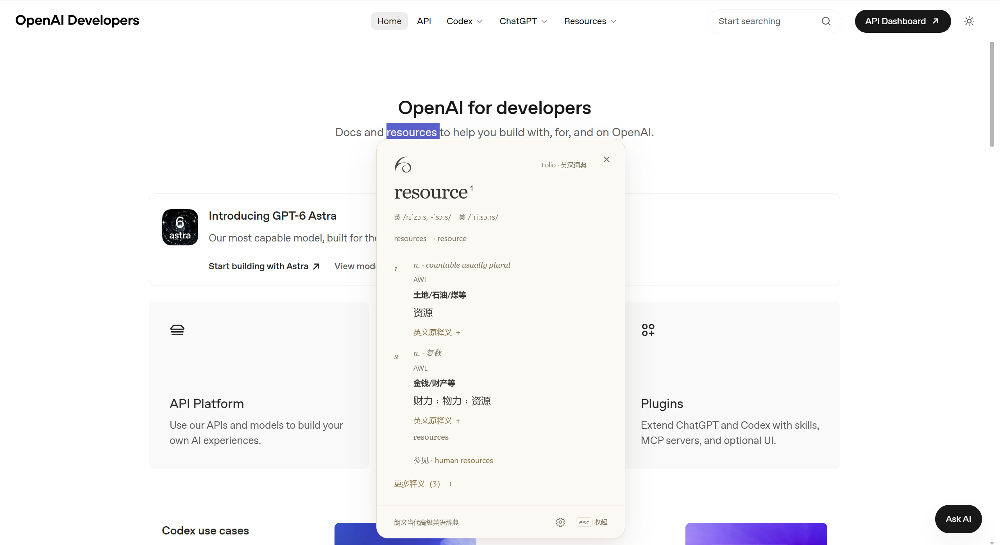
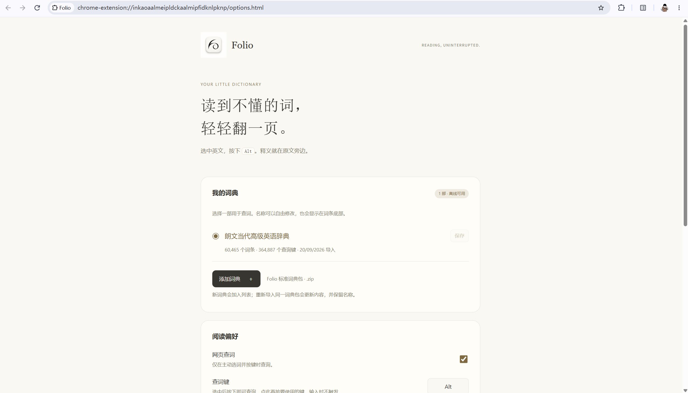

<div align="center">
  
  <h1>Folio</h1>
  <p>选中英文，按一下键。在一页温暖的小词典里，继续阅读。</p>
  <p><strong>本地词典 · 无需账号 · 查词离线</strong></p>
</div>



<p align="center"><sub>读到不懂的词，轻轻翻一页。卡片停在原文旁边，不必离开正在读的那一行。</sub></p>

## 它做什么

Folio 是 Chrome 里的离线词典。选中一个英文单词或短词组，按下快捷键（默认 **Enter**），释义出现在原文旁。

词典由你自己导入，保存在这台电脑上。程序不附带任何词典正文，也不需要账号或 API 密钥。查词全程离线；只有在设置页点击「检查更新」时，才会访问 GitHub 的公开 Release 接口。

## 特性

- 选中即查，默认 Enter；可改成 Alt、空格、F1–F12 或单个字母、数字
- 暖纸色卡片：衬线词头、音标、编号释义；优先中文，原英文可展开
- 按原词典索引处理原形、变形、缩写、别名、词组和派生词，不猜词根
- 未收录时，卡片提供 Google 搜索（默认 Enter，可改）
- 可保存多部词典，勾选其中一部用于查词；名称可改，词条底部会跟着变
- 没有可选中文字的页面，也能从工具栏或设置页查询
- 明暗外观跟随阅读页面，也可固定为暖纸色或深色
- 输入框和编辑器中不触发，避免打断打字

## 安装

本扩展暂未上架 Chrome 网上应用店。Windows 上的正式版 Chrome **不能**靠一行命令、拖入 `.crx` 或 `--load-extension` 装进你正在使用的浏览器。可靠做法只有一种：把文件放到本地文件夹，再在 Chrome 里 **加载已解压的扩展程序**。

**仓库里没有词典。** 安装的是程序；词典需要你稍后自行导入 Folio 标准词典包（`.zip`）。不要把 MDX、MDD、PDF 或转换好的词库提交进这个仓库。

本地编程助手（Cursor、Claude Code、Codex、本机 Grok 等）可以替你下载源码，**不能**替你点完 Chrome 里的加载步骤。网页里的 ChatGPT / Grok 对话既没有磁盘权限，也进不了 `chrome://extensions/`，请不要把下面的助手提示词发给它们。

### 用 Git（推荐）

以后更新只需在同一目录 `git pull`，不必再下压缩包、也不必覆盖文件。

```text
git clone https://github.com/issacsmit/Folio_dictionary.git
```

记住这个文件夹的位置。以后更新时，必须在**同一个**文件夹里执行 `git pull`，不要重新克隆一份。

打开该文件夹应能直接看到 `manifest.json`、`background.js`、`content.js`。Chrome 加载**这一个文件夹**。

```text
Folio_dictionary/       ← 在 Chrome 里选这一层
├── manifest.json
├── background.js
├── content.js
└── README.md
```

同层还有 `tests/`、`docs/` 等开发文件，留着即可。不要单独选 `tests` 或更外层的空壳目录。

### 用 ZIP（没有 Git 时）

1. 打开仓库页面：<https://github.com/issacsmit/Folio_dictionary>
2. 点击绿色的 **Code** → **Download ZIP**，或从 [Releases](https://github.com/issacsmit/Folio_dictionary/releases) 下载
3. 解压到一个你找得到、以后也不会随便挪走的位置
4. 源码 ZIP 解压后常会多一层 `Folio_dictionary-main`。无论哪一种压缩包，最终要加载的都是**里面直接含有 `manifest.json` 的那一层**

选中后应能直接看见 `manifest.json`、`background.js`、`content.js`。

### 在 Chrome 里加载

1. 地址栏进入 `chrome://extensions/`（复制粘贴即可）
2. 打开右上角 **开发者模式**
3. 点击 **加载已解压的扩展程序**
4. 选中上面这个含有 `manifest.json` 的文件夹，确认
5. 列表里应出现 Folio，状态为已启用
6. 点击工具栏中的 Folio 图标，进入「词典与设置」，导入你自己的词典包
7. 刷新已经打开的文章网页，选中一个英文单词，按 **Enter**

扩展卡片上通常会显示已解压的本地路径。请把这条路径记下或收藏，以后更新还要用。

**加载后看不到 Folio，或查词没有反应时：**

- 有没有选错目录：提示找不到 `manifest.json`，多半选到了上一级或子目录
- 已经打开的文章页在加载扩展**之后**是否刷新过；不刷新则页面里仍没有内容脚本
- 扩展页是否出现两个 Folio。若有，关掉或移除多出来的，只保留一份
- 本地 HTML 文件需在扩展详情中开启「允许访问文件网址」
- Chrome 内部页面、网上应用店和内置 PDF 阅读器暂不支持

### 用本地助手下载源码

把下面整段复制到**能读写磁盘的**编程助手。助手完成后，你仍须按「在 Chrome 里加载」的步骤操作。

```text
请把 Chrome 扩展 Folio 的源码下载到这台电脑。

仓库：https://github.com/issacsmit/Folio_dictionary.git

要求：
1. 若当前目录已经是该仓库（存在 manifest.json，且其中 "name" 为 "Folio"），不要再克隆一份，直接告诉我这个目录的绝对路径。
2. 否则优先用 git clone 克隆到用户主目录下容易找到的位置；若没有 git，再下载仓库 ZIP 并解压。
3. 克隆或解压完成后，确认该目录的第一层就有 manifest.json、background.js、content.js。若多出 *-main 这一层，以含 manifest.json 的那一层为准。
4. Chrome 要加载的就是这一层，不必再进入子文件夹。不要执行 npm install（使用本扩展不需要）。不要用 --load-extension、不要操作 Chrome、不要打开 chrome://extensions/、不要模拟点击「加载已解压的扩展程序」。Chrome 不允许脚本把扩展写进用户正在使用的浏览器配置。
5. 不要下载、拷贝或生成任何词典文件（MDX / MDD / PDF / 转换后的词库 ZIP）。本仓库不附带词典，词典由用户自行导入。
6. 完成后只输出：
   - 扩展根目录的绝对路径（第一层含 manifest.json）
   - 请用户打开 chrome://extensions/，开启开发者模式，点击「加载已解压的扩展程序」，选择刚才这个目录
   - 请用户点击工具栏 Folio 图标，自行导入 Folio 标准词典包；源码里没有词典
   - 请用户刷新已打开的文章页，选中英文后按 Enter
   - 请用户保存这个绝对路径，以后更新要用；更新时请使用本仓库 README 里的「用本地助手更新」提示词
```

## 导入词典

Folio 只接受 **Folio 标准词典包 v1.0**：一个 ZIP，内含 `manifest.json`、`entries.jsonl`、`lookup.jsonl`。原始 MDX / MDD、PDF 或任意其它 ZIP 不能直接导入。



<p align="center"><sub>词典只保存在这台设备。导入一次，即可离线查词。</sub></p>

1. 点击工具栏 Folio 图标，进入「词典与设置」
2. 选择你的 Folio 词典包（`.zip`）
3. 导入期间保持设置页打开，直到显示「导入完成」
4. 回到文章页，选词即可查询

「我的词典」可保留多部，勾选其中一部用于查词。在名称框中改名并保存，已打开的词条会同步显示新名称。重新导入同一 `pack_id` 会更新内容，并保留你起的名字。

压缩包上限 120 MiB。导入在独立 Worker 中校验后再写入 IndexedDB；失败或中途关闭不会替换已经能用的词典。卸载扩展会删除本机词典数据，请保留原 ZIP。

## 使用

1. 在普通网页选中英文单词或短词组
2. 按 **Enter**（可在设置中更换）
3. 卡片出现在原文旁。点击卡片外、关闭按钮或 **Esc** 收起
4. 词条底部的齿轮可打开设置；长词条滚动时也能看到
5. 词典没有这个词时，按设置里的搜索键（默认 Enter）用 Google 查找

输入时不触发。首次安装或更新后，请刷新已打开的网页。

在扩展管理页重新加载 Folio 后，旧网页仍保留原来的内容脚本。此时查词或点击旧卡片的设置入口会提示刷新网页，刷新后即可恢复；无需卸载或重新导入词典。

## 更新

加载已解压的扩展**不会**随 GitHub 自动更新。你改完磁盘上的文件后，还要让 Chrome 和已经打开的页面都换上新脚本。

1. 更新文件夹里的源码（优先 `git pull`；当初是 ZIP 安装的见下面）
2. 打开 `chrome://extensions/`，在 Folio 卡片上点 **重新加载**
3. 刷新已经打开的文章标签。只重新加载扩展、不刷新页面，标签里仍运行旧版内容脚本

也可在「词典与设置」中点击「检查更新」。若发现新版本，会给出打开 GitHub 说明的按钮；更新文件后仍须重新加载扩展并刷新文章页。

不要再次「加载已解压的扩展程序」来更新，否则会装成第二份。已导入的词典在重新加载后仍在，不必重导。

**Git 安装的更新（推荐）：** 打开当初 `git clone` 出来的那个目录（也就是 Chrome 正在加载的那个文件夹），执行 `git pull`。这只会把该目录里的文件更新到 GitHub 最新，不会另外克隆一份。`git pull` 之后仍须做上面的第 2、3 步。

**ZIP 安装的更新：** 再从 GitHub 下载一份新的压缩包（和第一次下载的是另一份）。解压后，把里面的文件**复制并覆盖**到 Chrome 正在加载的那个旧目录里（路径看扩展卡片），不要把新解压出来的文件夹再「加载已解压」一次。覆盖完成后，同样做第 2、3 步。


### 用本地助手更新

把下面整段复制给能读写磁盘的编程助手。

```text
请更新这台电脑上已经在用的 Chrome 扩展 Folio（仓库 https://github.com/issacsmit/Folio_dictionary）。

这不是新安装。用户可能早在别的对话、别的工具里下载过源码，你未必知道目录在哪。

请按这个顺序做：
1. 先问用户：Chrome 里加载的扩展根目录绝对路径是什么？可提示他们到 chrome://extensions/ 打开 Folio 卡片，抄下已解压路径。这条路径的第一层应能看到 manifest.json。
2. 若用户暂时给不出路径，再在常见位置搜索：目录中同时存在 manifest.json、background.js、content.js，且 manifest.json 的 "name" 为 "Folio"。找到多个就列出来让用户选，不要擅自挑一个覆盖。找不到就停下来，让用户改用 README 的手动更新步骤。
3. 确认目标目录后：
   - 若该目录是 git 仓库且 remote 指向上述 GitHub 仓库：在该目录 git pull，不要在别处重新 clone。
   - 若不是 git 仓库：下载该仓库最新源码，把文件覆盖进这个已有目录，保持 Chrome 正在加载的路径不变。不要新建第二个文件夹，不要再次执行「加载已解压的扩展程序」。
4. 不要执行 npm install。不要用命令行给正在运行的 Chrome 热加载扩展。不要打开或操作 chrome:// 页面。不要下载、拷贝或覆盖任何词典数据（MDX / MDD / PDF / 词库 ZIP / IndexedDB）。词典由用户自行导入，更新程序不应触碰它们。
5. 完成后只输出：
   - 实际更新了哪一个绝对路径
   - 请用户到 chrome://extensions/ 对 Folio 点「重新加载」
   - 请用户刷新已经打开的文章标签（只 reload 扩展不够）
   - 若 git pull 显示已经是最新，也仍然提醒这两步，以免页面里还是旧脚本
```

## 隐私与权限

- 网页访问范围：用于监听主动查词按键和在网页中显示卡片。仅触发时读取所选文字，不保存或上传网页正文、历史、查询记录
- `storage`：保存快捷键、主题、启用状态
- `unlimitedStorage`：让本地词典使用 IndexedDB，不受普通扩展小容量限制；实际仍受可用磁盘空间限制
- `https://api.github.com/*`：仅为检查更新准备。平时不联网；只有点击「检查更新」时，才读取公开的 latest Release。不调用模型服务，也不读取或保存 API Key

所有脚本随扩展提供。不执行词典里的 HTML、CSS 或脚本，显示内容通过文本节点创建。扩展页面只允许连接到 `https://api.github.com`。程序与词典数据分离：`npm run package` 只打包运行所需的程序文件，不含词典正文、测试或研究材料。

## 开发

使用本扩展不需要安装 Node。改代码后：在 `chrome://extensions/` 点 **重新加载**，再刷新已打开的文章页。

开发测试需要 Node.js 22+ 和 Playwright：

```text
npm ci
npm test
npm run test:update
npm run test:browser
npm run test:reload
npm run package
```

`npm test` 不依赖任何词典文件。`npm run test:update` 在独立浏览器里打开设置页，拦截 GitHub 接口，不访问真实网络。全量浏览器测试需要本机已有 Folio 词典包，不会下载、打包或公开该包。

浏览器测试在 `tmp/` 创建独立配置，不接触日常 Chrome 数据。Windows 上优先使用现有 Playwright Chromium 缓存；也可用 `FOLIO_TEST_BROWSER` 指定 Chrome for Testing 的 `chrome.exe`。

Chrome 加载仓库根目录（含 `manifest.json` 的那一层）。`npm run package` 只收集运行文件，产物为 `dist/folio-<version>.zip`。

```text
.
├── manifest.json        # Chrome 加载这一层
├── background.js
├── content.js
├── card.js
├── options.html
├── lib/update-check.js
├── icons/
├── docs/images/         # README 配图
├── tests/               # 自动化测试
├── scripts/package.mjs  # 只打包运行文件
├── README.md
└── LICENSE
```

## 许可证

本项目采用 [MIT License](LICENSE)。许可证覆盖程序源码，**不覆盖**你自行导入的词典内容。请只导入你有权使用的词库。
